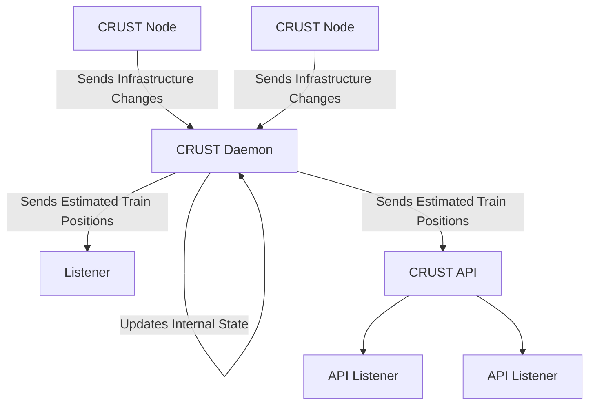

# CRUST - Consolidated, Realtime Updates on Status of Trains

**IMPORTANT: CRUST is not intended for any safety critical purpose. It 
makes a best-guess at the state of a railway and should never be assumed 
to be accurate.**

CRUST is a project in the early stages of development that aims to provide
a system to monitor the positions of trains and to provide status updates
to both human beings and other railway systems. **CRUST is not yet suitable 
for production use.**

The centre point of a CRUST deployment is the CRUST daemon. The daemon
receives data from various CRUST nodes about the state of the line, updates
it's internal picture of the railway and dispatches updates to listeners.
The daemon understands the layout of the line and the expected moves. It
is able to combine this knowledge with the updates taken from CRUST nodes 
to predict the positions of trains.

CRUST nodes watch the status of pieces of railway infrastructure and report
changes back to the daemon. For example, a CRUST node installed in the locking
room of a signal box can watch the status of track circuits and feed back
to the daemon each time a track circuit becomes occupied or clears.

Listeners are independent systems which receive updates from the CRUST daemon
and take action based on these updates. The daemon itself uses a simple text
based interface to communicate with listeners.

It is intended for there to be a CRUST API which takes updates from the daemon
and makes them available in a more accessible format such as JSON over 
WebSocket.

Currently, CRUST's node functionality is being designed around a RaspberryPi. 
The intention is that the general purpose input and output (GPIO) pins that
come with a standard model RasberryPi can be used to monitor track circuit
relays.

